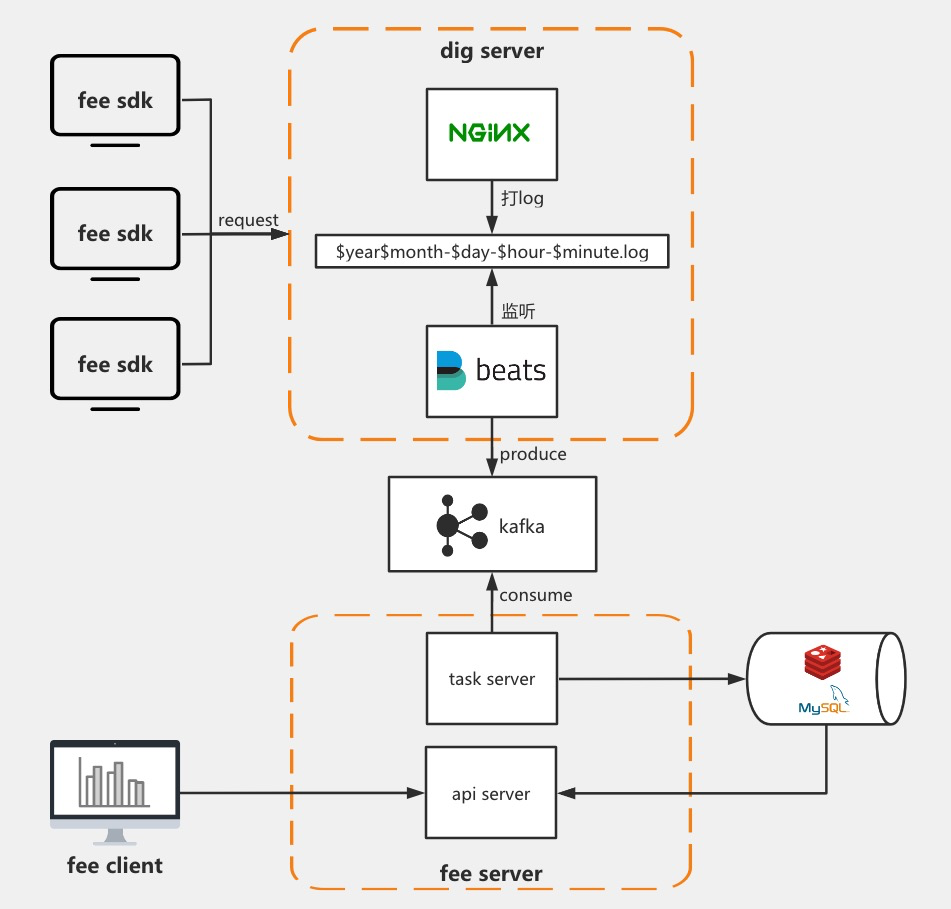

# fee-flow

fee的文档不是很清晰，所以整理了一下。

## fee介绍

> [fee（灯塔）](https://github.com/LianjiaTech/fee) 是前端监控系统，贝壳找房主要前端监控系统，服务公司上百条产品线。 特点：架构简单、轻量、支持私有化部署。可收集前端设备、系统、环境信息， 可以对前端页面js报错、资源错误、性能指标进行配置报警等， 并且可以通过上报错误信息引导用户快速定位解决问题。

### 架构图



## 1. nginx

1. 配置日志格式 log_format
2. 配置打点服务，并设置access_log日志存放路径
3. 打点服务中，利用nginx自带的empty_gif模块，配置一个空gif的静态资源服务

另外需要：

1. 新建一个nginx日志存放的文件夹

    ```bash
    mkdir -p /var/log/nginx/ferms
    ```

2. 启动nginx的用户，对这个文件夹有读写权限

    ```bash
    -rw-r--r-- 1 nginx nginx 14201 Sep  1 14:35 202009-01-14-35.log
    ```

3. dig-log的日志，为防止占满磁盘，需要定期清除，可以设置时间间隔为1到3天

```bash
log_format ferms '$time_iso8601     -       -       $remote_addr    $http_host      $status $request_time   $request_length $body_bytes_sent        15d04347-be16-b9ab-0029-24e4b66459509689c3ea-5155-2df7-a719-e90d2dedeb2c 937ba755-116a-18e6-0735-312cba23b00c        -       -       $request_uri    $http_user_agent        -       sample=-&_UC_agent=-&device_id=-&-      -   -';
http {
    server {
        listen 80;
        server_name ferms.xxx.com;
        return 301 https://ferms.xxx.com$request_uri;
    }
    server {
        listen 443 ssl;
        server_name ferms.xxx.com;

        ssl_certificate      /etc/nginx/ssl/xxx.crt;
        ssl_certificate_key  /etc/nginx/ssl/xxx.key;

        if ($time_iso8601 ~ "^(\d{4})-(\d{2})-(\d{2})T(\d{2}):(\d{2})") {
            set $year $1;
            set $month $2;
            set $day $3;
            set $hour $4;
            set $minute $5;
        }
        access_log /var/log/nginx/ferms/$year$month-$day-$hour-$minute.log ferms;
        location = /dig.gif {
            empty_gif;
        }
    }
}
```

### 1.1 测试nginx服务

1. 访问`https://ferms.xxx.com/dig.gif?a=1`
2. 观察`/var/log/nginx/ferms/`文件夹下是否产生日志文件，例如`202009-01-14-35.log`

## 2. kafka

### 2.1 配置hosts

在打点服务所在机器，根据kafka集群的hostname配置hosts

```bash
# vim `/etc/hosts`
# kafka
xxx.xxx.xxx.xxx kafka1
yyy.yyy.yyy.yyy kafka2
zzz.zzz.zzz.zzz kafka3
```

### 2.2 下载kafka

为方便调试，可下载kafka

[镜像下载地址](http://mirror.bit.edu.cn/apache/kafka/)

```bash
cd /your/path/to/kafka_2.12-2.5.0
```

### 2.3 常用kafka命令

#### 查看topic列表

```bash
./kafka-consumer-groups.sh --bootstrap-server 10.112.208.70:9092,10.112.208.209:9092,10.112.208.210:9092 --list
```

#### 生产消息

```bash
./kafka-console-producer.sh --broker-list 10.112.208.70:9092,10.112.208.209:9092,10.112.208.210:9092 --topic fee
```

#### 消费消息

```bash
./kafka-console-consumer.sh --bootstrap-server=10.112.208.70:9092,10.112.208.209:9092,10.112.208.210:9092 --topic fee --from-beginning
```

#### 查看某个topic消费情况

```bash
./kafka-consumer-groups.sh --bootstrap-server 10.112.208.70:9092,10.112.208.209:9092,10.112.208.210:9092 --describe -group test-group
```

#### 启动kafka

```bash
./bin/kafka-server-start.sh ./config/server.properties &
```

#### 阿里云预发布kafka地址

```bash
xxx.xxx.xxx.xxx
yyy.yyy.yyy.yyy
zzz.zzz.zzz.zzz
```

#### 参考文档

[Kafka 概念、单机搭建与使用](https://www.cnblogs.com/primadonna/p/10476663.html)

## 3. filebeat

### 3.1 filebeat安装

[安装官方文档](https://www.elastic.co/guide/en/beats/filebeat/7.8/setup-repositories.html#_yum)

1. Download and install the public signing key:

```bash
sudo rpm --import https://packages.elastic.co/GPG-KEY-elasticsearch
```

2. Create a file with a .repo extension (for example, `elastic.repo`) in your `/etc/yum.repos.d/` directory and add the following lines:

```bash
[elastic-7.x]
name=Elastic repository for 7.x packages
baseurl=https://artifacts.elastic.co/packages/7.x/yum
gpgcheck=1
gpgkey=https://artifacts.elastic.co/GPG-KEY-elasticsearch
enabled=1
autorefresh=1
type=rpm-md
```

```bash
sudo yum install filebeat
```

安装后:

- `bin`所在目录为：`/usr/share/filebeat`
- `配置文件`所在目录为：`/etc/filebeat/filebeat.yml`

### 3.2 filebeat配置

```bash
vim /etc/filebeat/filebeat.yml
```

1. 如果是老版本filebeat，`filebeat.inputs`的字段名称会是`filebeat.prospectors`，启动会报错：

```bash
Exiting: 1 error: setting 'filebeat.prospectors' has been removed
```

故修改为：

```bash
# ============================== Filebeat inputs ===============================
# 把filebeat.prospectors:
# 修改为
filebeat.inputs:
```

2. 配置`filebeat.inputs`的`enabled`为`true`

3. 配置`filebeat.inputs`的`paths`为`nginx日志文件路径`

```bash
# ============================== Filebeat inputs ===============================
filebeat.inputs:
- type: log
  enabled: true
  paths:
    - /var/log/nginx/ferms/*.log
```

4. 配置`output.kafka`的`hosts`和`topic`

```bash
# ================================== Outputs ===================================

output.kafka:
  hosts: ["xxx.xxx.xxx.xxx:9092","yyy.yyy.yyy.yyy:9092","zzz.zzz.zzz.zzz:9092"]
  topic: "fee"
```

5. filebeat需要把一些无用的fields字段删除：

```bash
# ================================= Processors =================================
processors:
  - drop_fields:
      fields: ["@timestamp", "@metadata", "log", "input", "ecs", "host", "agent"]
```

`drop_fields`具体配置参见[官网](https://www.elastic.co/guide/en/beats/filebeat/current/drop-fields.html)

具体配置如下：

```yml
###################### Filebeat Configuration Example #########################

# This file is an example configuration file highlighting only the most common
# options. The filebeat.reference.yml file from the same directory contains all the
# supported options with more comments. You can use it as a reference.
#
# You can find the full configuration reference here:
# https://www.elastic.co/guide/en/beats/filebeat/index.html

# For more available modules and options, please see the filebeat.reference.yml sample
# configuration file.

# ============================== Filebeat inputs ===============================

filebeat.inputs:

# Each - is an input. Most options can be set at the input level, so
# you can use different inputs for various configurations.
# Below are the input specific configurations.

- type: log

  # Change to true to enable this input configuration.
  enabled: true

  # Paths that should be crawled and fetched. Glob based paths.
  paths:
    - /var/log/nginx/ferms/*.log
    #- c:\programdata\elasticsearch\logs\*

  # Exclude lines. A list of regular expressions to match. It drops the lines that are
  # matching any regular expression from the list.
  #exclude_lines: ['^DBG']

  # Include lines. A list of regular expressions to match. It exports the lines that are
  # matching any regular expression from the list.
  #include_lines: ['^ERR', '^WARN']

  # Exclude files. A list of regular expressions to match. Filebeat drops the files that
  # are matching any regular expression from the list. By default, no files are dropped.
  #exclude_files: ['.gz$']

  # Optional additional fields. These fields can be freely picked
  # to add additional information to the crawled log files for filtering
  #fields:
  #  level: debug
  #  review: 1

  ### Multiline options

  # Multiline can be used for log messages spanning multiple lines. This is common
  # for Java Stack Traces or C-Line Continuation

  # The regexp Pattern that has to be matched. The example pattern matches all lines starting with [
  #multiline.pattern: ^\[

  # Defines if the pattern set under pattern should be negated or not. Default is false.
  #multiline.negate: false

  # Match can be set to "after" or "before". It is used to define if lines should be append to a pattern
  # that was (not) matched before or after or as long as a pattern is not matched based on negate.
  # Note: After is the equivalent to previous and before is the equivalent to to next in Logstash
  #multiline.match: after

# ============================== Filebeat modules ==============================

filebeat.config.modules:
  # Glob pattern for configuration loading
  path: ${path.config}/modules.d/*.yml

  # Set to true to enable config reloading
  reload.enabled: false

  # Period on which files under path should be checked for changes
  #reload.period: 10s

# ======================= Elasticsearch template setting =======================

setup.template.settings:
  index.number_of_shards: 3
  #index.codec: best_compression
  #_source.enabled: false


# ================================== General ===================================

# The name of the shipper that publishes the network data. It can be used to group
# all the transactions sent by a single shipper in the web interface.
#name:

# The tags of the shipper are included in their own field with each
# transaction published.
#tags: ["service-X", "web-tier"]

# Optional fields that you can specify to add additional information to the
# output.
#fields:
#  env: staging

# ================================= Dashboards =================================
# These settings control loading the sample dashboards to the Kibana index. Loading
# the dashboards is disabled by default and can be enabled either by setting the
# options here or by using the `setup` command.
#setup.dashboards.enabled: false

# The URL from where to download the dashboards archive. By default this URL
# has a value which is computed based on the Beat name and version. For released
# versions, this URL points to the dashboard archive on the artifacts.elastic.co
# website.
#setup.dashboards.url:

# =================================== Kibana ===================================

# Starting with Beats version 6.0.0, the dashboards are loaded via the Kibana API.
# This requires a Kibana endpoint configuration.
setup.kibana:

  # Kibana Host
  # Scheme and port can be left out and will be set to the default (http and 5601)
  # In case you specify and additional path, the scheme is required: http://localhost:5601/path
  # IPv6 addresses should always be defined as: https://[2001:db8::1]:5601
  #host: "localhost:5601"

  # Kibana Space ID
  # ID of the Kibana Space into which the dashboards should be loaded. By default,
  # the Default Space will be used.
  #space.id:

# =============================== Elastic Cloud ================================

# These settings simplify using Filebeat with the Elastic Cloud (https://cloud.elastic.co/).

# The cloud.id setting overwrites the `output.elasticsearch.hosts` and
# `setup.kibana.host` options.
# You can find the `cloud.id` in the Elastic Cloud web UI.
#cloud.id:

# The cloud.auth setting overwrites the `output.elasticsearch.username` and
# `output.elasticsearch.password` settings. The format is `<user>:<pass>`.
#cloud.auth:

# ================================== Outputs ===================================

# Configure what output to use when sending the data collected by the beat.

output.kafka:
  hosts: ["xxx.xxx.xxx.xxx:9092","yyy.yyy.yyy.yyy:9092","zzz.zzz.zzz.zzz:9092"]
  topic: "fee"

# ---------------------------- Elasticsearch Output ----------------------------
#output.elasticsearch:
  # Array of hosts to connect to.
  #hosts: ["localhost:9200"]

  # Protocol - either `http` (default) or `https`.
  #protocol: "https"

  # Authentication credentials - either API key or username/password.
  #api_key: "id:api_key"
  #username: "elastic"
  #password: "changeme"

# ------------------------------ Logstash Output -------------------------------
#output.logstash:
  # The Logstash hosts
  #hosts: ["localhost:5044"]

  # Optional SSL. By default is off.
  # List of root certificates for HTTPS server verifications
  #ssl.certificate_authorities: ["/etc/pki/root/ca.pem"]

  # Certificate for SSL client authentication
  #ssl.certificate: "/etc/pki/client/cert.pem"

  # Client Certificate Key
  #ssl.key: "/etc/pki/client/cert.key"

# ================================= Processors =================================
processors:
  - drop_fields:
      fields: ["@timestamp", "@metadata", "log", "input", "ecs", "host", "agent"]

# ================================== Logging ===================================

# Sets log level. The default log level is info.
# Available log levels are: error, warning, info, debug
# logging.level: debug

# At debug level, you can selectively enable logging only for some components.
# To enable all selectors use ["*"]. Examples of other selectors are "beat",
# "publish", "service".
#logging.selectors: ["*"]

# ============================= X-Pack Monitoring ==============================
# Filebeat can export internal metrics to a central Elasticsearch monitoring
# cluster.  This requires xpack monitoring to be enabled in Elasticsearch.  The
# reporting is disabled by default.

# Set to true to enable the monitoring reporter.
#monitoring.enabled: false

# Sets the UUID of the Elasticsearch cluster under which monitoring data for this
# Filebeat instance will appear in the Stack Monitoring UI. If output.elasticsearch
# is enabled, the UUID is derived from the Elasticsearch cluster referenced by output.elasticsearch.
#monitoring.cluster_uuid:

# Uncomment to send the metrics to Elasticsearch. Most settings from the
# Elasticsearch output are accepted here as well.
# Note that the settings should point to your Elasticsearch *monitoring* cluster.
# Any setting that is not set is automatically inherited from the Elasticsearch
# output configuration, so if you have the Elasticsearch output configured such
# that it is pointing to your Elasticsearch monitoring cluster, you can simply
# uncomment the following line.
#monitoring.elasticsearch:

# ============================== Instrumentation ===============================

# Instrumentation support for the filebeat.
#instrumentation:
    # Set to true to enable instrumentation of filebeat.
    #enabled: false

    # Environment in which filebeat is running on (eg: staging, production, etc.)
    #environment: ""

    # APM Server hosts to report instrumentation results to.
    #hosts:
    #  - http://localhost:8200

    # API Key for the APM Server(s).
    # If api_key is set then secret_token will be ignored.
    #api_key:

    # Secret token for the APM Server(s).
    #secret_token:


# ================================= Migration ==================================

# This allows to enable 6.7 migration aliases
#migration.6_to_7.enabled: true
```

### 3.3 filebeat启动、状态和停止

系统启动：

```bash
service filebeat start
service filebeat status
service filebeat stop
```

或bin启动：

```bash
/usr/share/filebeat/bin/filebeat -e -c /etc/filebeat/filebeat.yml
```

### 3.4 测试

```bash
./kafka-console-consumer.sh --bootstrap-server=10.112.208.70:9092,10.112.208.209:9092,10.112.208.210:9092 --topic fee --from-beginning
```

kafka接收到的消息内容：

```json
{
    "@timestamp": "2020-07-17T06:52:48.899Z",
    "@metadata": {
        "beat": "filebeat",
        "type": "_doc",
        "version": "7.8.0"
    },
    "ecs": {
        "version": "1.5.0"
    },
    "host": {
        "name": "high-52"
    },
    "log": {
        "offset": 0,
        "file": {
            "path": "/etc/nginx/logs/dig-log/202007-17-14-52.log"
        }
    },
    "message": "17/Jul/2020:14:52:41 +0800                      -       -       - xxx.xxx.com  304 0.000 594 0      15d04347-be16-b9ab-0029-24e4b6645950    -       -       9689c3ea-5155-2df7-a719-e90d2dedeb2c 937ba755-116a-18e6-0735-312cba23b00c    GET /dig.gif?a=iAmAMessageFromBrowser HTTP/1.1  -       Mozilla/5.0 (Macintosh; Intel Mac OS X 10_15_5) AppleWebKit/537.36 (KHTML, like Gecko) Chrome/83.0.4103.116 Safari/537.36     -       sample=-&_UC_agent=-&lianjia_device_id=-&-      -       -       -",
    "input": {
        "type": "log"
    },
    "agent": {
        "id": "5d6667a6-31eb-48e4-b9a5-0881c38a00d0",
        "name": "high-52",
        "type": "filebeat",
        "version": "7.8.0",
        "hostname": "high-52",
        "ephemeral_id": "3e8701c7-a37a-47d6-9469-267aec61ea0b"
    }
}
```

### 3.5 filebeat常见问题

1. 当碰到问题，可以配置日志级别为debug，查看详细日志

    ```bash
    # vim /etc/filebeat/filebeat.yml
    logging.level: debug
    ```

    ```bash
    tail -f  /var/lib/filebeat/registry/filebeat/log.json
    ```

### 3.6 filebeat参考文档

[filebeat命令参考](https://my.oschina.net/ch66880/blog/1619087)

## 4. mysql

1. 创建fee数据库
2. 然后执行`npm run prod_fee Utils:GenerateSQL 1 '2018-01' '2020-10' > init.sql` 生成数据库SQL

    ```js
    `
    Utils:GenerateSQL
    {projectIdList:项目id列表,逗号分割}
    {startAtYm:建表日期开始时间(包括该时间),${DATE_FORMAT.COMMAND_ARGUMENT_BY_MONTH}格式}
    {finishAtYm:建表日期结束时间(包括该时间),${DATE_FORMAT.COMMAND_ARGUMENT_BY_MONTH}格式}
    `
    ```

3. 执行`mysql -u root -h 127.0.0.1  platform -p < init.sql`, 执行建表语句

4. 通过插入语句创建新项目

    ```js
    // id, 抽样比率, 项目名(展示), 项目id, 负责人信息
    // project_test_id
    REPLACE INTO `t_o_project` (`id`, `rate`, `display_name`, `project_name`, `c_desc`, `is_delete`, `create_ucid`, `update_ucid`, `create_time`, `update_time`) VALUES (1, 10000, '测试项目', 'project_test_id', '测试项目负责人', 0, '', '', 0, 0);
    ```

## 5. fee server

### 5.1 环境确认

为确保`node-rdkafka`顺利编译和运行，检查是否安装了`gcc+`、`gcc-c++`、`zlib-devel`，否则可能产生难以定位的问题。

```bash
yum -y install gcc+ gcc-c++ zlib-devel
```

### 5.2 配置fee server

1. 配置`server/src/configs/common.js`

    ```js
    const production = {
        use: {
            kafka: true, // 是否使用kafka。如果没有kafka，设为false，并且指定下面的nginxLogFilePath
        }
        // ...
    }
    ```

2. 配置`server/src/configs/kafka.js`

    ```js
    const production = {
        'group.id': 'fee',
        'metadata.broker.list': 'xxx.xxx.xxx.xxx:9092, yyy.yyy.yyy.yyy:9092, zzz.zzz.zzz.zzz:9092',
    }
    ```

3. 配置`server/src/configs/mysql.js`

    ```js
    const production = {
        host: 'xxx.com',
        port: '3306',
        user: 'xxx',
        password: 'xxx',
        database: 'fee'
    }
    ```

4. 配置`server/src/configs/redis.js`

    ```js
    const production = {
        host: 'xxx.com',
        port: '6379',
        db: '4',
        password: 'xxx'
    }
    ```

5. 配置`server/src/library/redis/index.js`

    ```js
    class RedisClient {
    constructor (isTest = false) {
        this.redisClient = new Redis({
        // ...
        password: redisConfig.password,
    ```

6. 修改`server/src/app.js`

    ```js
    const app = express()
    // 设置存放模板引擎目录
    app.set('views', path.join(__dirname, '../public'))
    // 设置模板引擎为ejs
    // app.set('view engine', 'ejs')
    app.engine('html', ejs.renderFile)
    app.set('view engine', 'html')
    ```

7. 修改`server/bin/run.sh`

    ```shell
    FEE_COMMAND="Task:Manager" # 上线时直接把它改成Task:Manager即可
    ```

8. 修改`server/src/commands/save_log/parseKafkaLog.js`

    ```js
    // 适配filebeat
    if (content.includes('@timestamp') && content.includes('@metadata')) {
        const dataObj = JSON.parse(content);
        content = dataObj.message || '';
    }
    ```

### 5.3 启动server

进程守护启动：

```bash
pm2 start ./pm2_fee_task_manager.json --env production
pm2 start ./pm2_fee_app.json --env production
```

观察server日志：

```bash
tail -f ./log/pm2/command/task-manager-out.log
```

### 5.4 调试相关

1. 启动server watch，响应实时修改

    ```bash
    npm run watch
    ```

2. 开发启动

    ```bash
    npm run dev
    ```

3. 前台启动

    ```bash
    ./bin sh ./run.sh run production
    ```

4. kafka消费调试

    ```bash
    NODE_ENV=testing node dist/fee.js SaveLog:Kafka
    ```

5. 入库调试

    ```bash
    # [按小时] 解析nginx日志, 分析分钟级别的指定时间范围内的性能指标
    NODE_ENV=testing node dist/fee.js Parse:Monitor "2020-09-01 10:26"  "2020-09-01 14:27"
    ```

6. 汇总调试

    ```bash
    NODE_ENV=testing node dist/fee.js Summary:Performance "2020-09-01 14" hour
    NODE_ENV=testing node dist/fee.js Summary:Performance "2020-09-01" day
    NODE_ENV=testing node dist/fee.js Summary:Performance "2020-09" month
    ```
